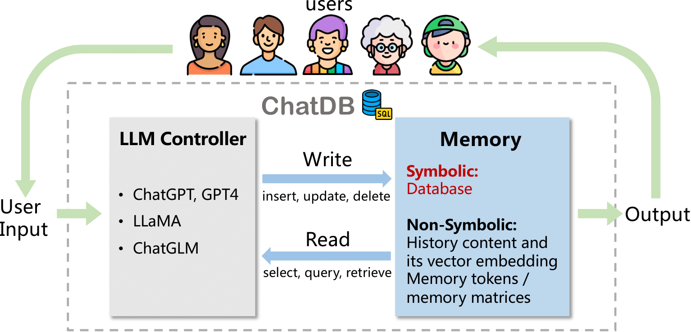
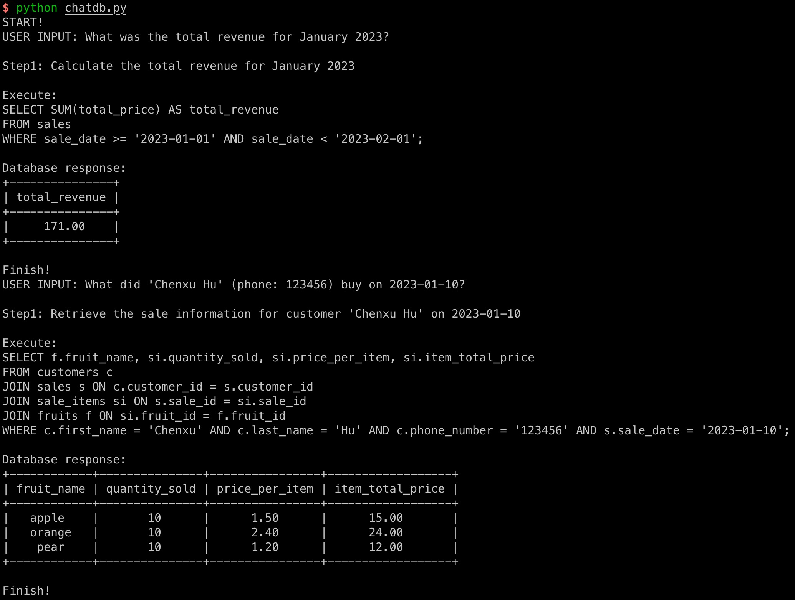

# ChatDB: Augmenting LLMs with Databases as Their Symbolic Memory

### [Paper](https://arxiv.org/abs/2306.03901) | [Project Page](https://chatdatabase.github.io/)

This is the official repository of the paper: **ChatDB: Augmenting LLMs with Databases as Their Symbolic Memory**.

**We will continuously add new features to this code repository. Please stay tuned!**



Large language models (LLMs) with memory are computationally universal.
However, mainstream LLMs are not taking full advantage of memory, and the designs are heavily influenced by biological brains.
Due to their approximate nature and proneness to the accumulation of errors, conventional neural memory mechanisms cannot support LLMs to simulate complex reasoning.
In this paper, we seek inspiration from modern computer architectures to augment LLMs with symbolic memory for complex multi-hop reasoning.
Such a symbolic memory framework is instantiated as an LLM and a set of SQL databases, where the LLM generates SQL instructions to manipulate the SQL databases.
We validate the effectiveness of the proposed memory framework on a synthetic dataset requiring complex reasoning.

## Quick Start
### Install dependencies
```bash
conda create -n chatdb python=3.9
conda activate chatdb
pip install -r requirements.txt
```

### Add keys
```bash
cp .env.template .env
# add OPENAI_API_KEY and MYSQL_PASSWORD
```

### A minimal CLI demo in a fruit shop scenario
```bash
python chatdb.py
```
The CLI demo looks as follows.


## Citation
If you find our work useful for your research, please consider citing the paper:
```bash
@misc{hu2023chatdb,
      title={ChatDB: Augmenting LLMs with Databases as Their Symbolic Memory},
      author={Chenxu Hu and Jie Fu and Chenzhuang Du and Simian Luo and Junbo Zhao and Hang Zhao},
      year={2023},
      eprint={2306.03901},
      archivePrefix={arXiv},
      primaryClass={cs.AI}
}
```